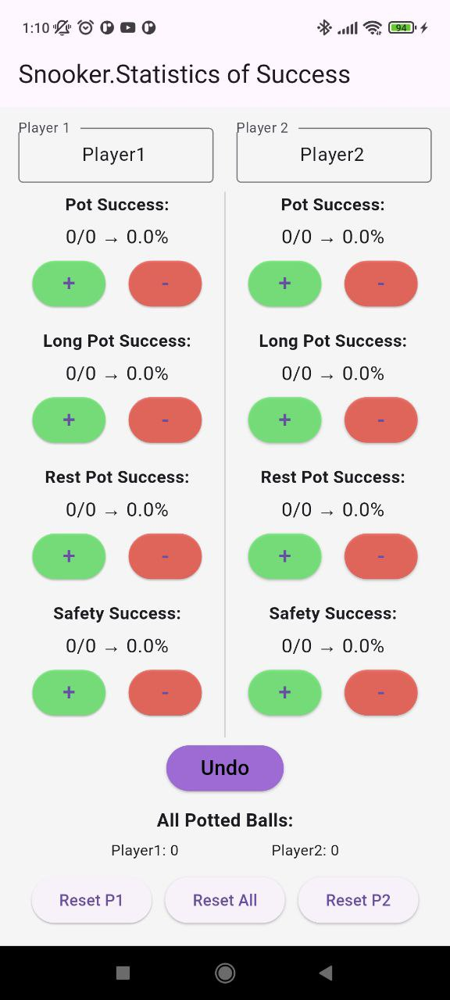

# Snooker Statistics App

Приложение для отслеживания статистики успешных ударов в снукере. Оно позволяет записывать и анализировать успешные и неудачные удары для двух игроков, а также предоставляет возможность отмены последнего действия.

## 🚀 Функции и возможности

### Основные функции:

#### Отслеживание статистики:

- **Pot Success**: Общее количество успешных и неудачных ударов.
- **Long Pot Success**: Успешные и неудачные удары на дальние дистанции.
- **Rest Pot Success**: Успешные и неудачные удары с использованием реста.
- **Safety Success**: Успешные и неудачные удары в защите.

#### Автоматическое обновление:

- При успешном ударе в **Long Pot Success** или **Rest Pot Success** автоматически обновляется статистика в **Pot Success**.
- При неудачном ударе в этих строках также обновляется статистика в **Pot Success**.

#### Ручная корректировка:

- Возможность вручную увеличивать или уменьшать количество успешных и неудачных ударов в каждой строке.

#### Отмена последнего действия (**Undo**):

- Кнопка **Undo** позволяет отменить последнее изменение в статистике.

#### Сброс статистики:

- Возможность сбросить статистику для одного игрока или для обоих игроков одновременно.

#### Подсчет общих шаров:

- Отображается общее количество сыгранных шаров для каждого игрока.

---

## 🛠️ Требования для запуска

### Установка Flutter:

Чтобы запустить этот код на телефоне, необходимо установить **Flutter** на ваш компьютер.

### Шаги по установке:

#### 1. Установите Flutter:

- Скачайте **Flutter SDK** с [официального сайта](https://flutter.dev).
- Распакуйте архив и добавьте путь к папке `flutter/bin` в переменную окружения `PATH`.

#### 2. Настройте устройство:

- **Подключите телефон** к компьютеру через **USB**.
- **Включите режим разработчика** на телефоне:

  - Перейдите в **Настройки > О телефоне** и нажмите на **номер сборки** 7 раз.
  - Включите **Отладку по USB** в меню разработчика.

## Настройте устройство

### Подключите телефон к компьютеру через USB.

1. Включите режим разработчика на телефоне:

   - Перейдите в **Настройки > О телефоне**.
   - Нажмите на **номер сборки** 7 раз.

2. Включите **Отладку по USB** в меню разработчика.

3. Убедитесь, что устройство распознано:
   - В терминале выполните команду:
     ```sh
     flutter devices
     ```
   - Ваше устройство должно отобразиться в списке.

## Запустите приложение

1. Откройте проект в **Android Studio** или **VS Code**.
2. В терминале выполните команду:
   ```sh
   flutter run
   ```
   Приложение будет установлено и запущено на вашем телефоне.

## 📱 Скриншоты приложения



## 📝 Весия приложения

0.1.1

## 🤝 Контакты

Если у вас есть вопросы или предложения, свяжитесь со мной:

- **Email**:
- **GitHub**:
